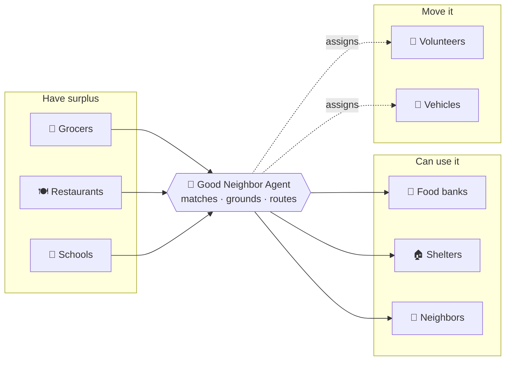
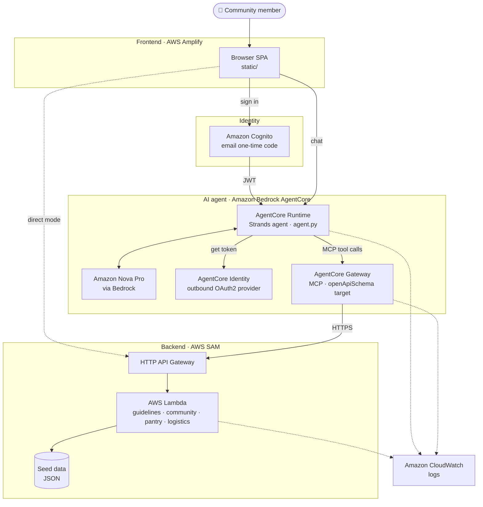
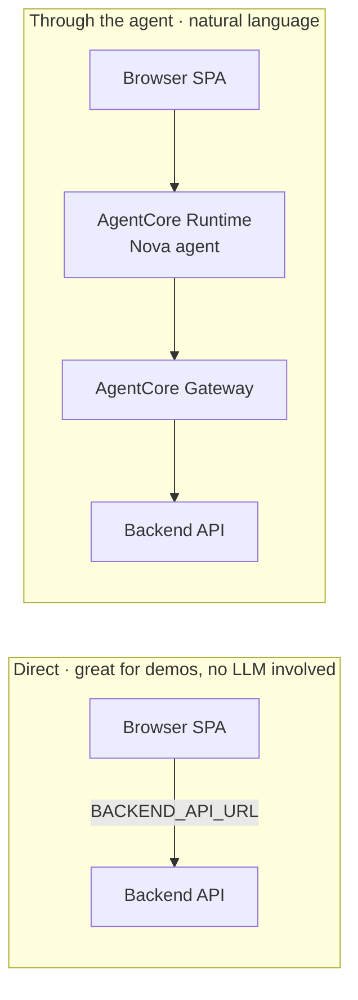
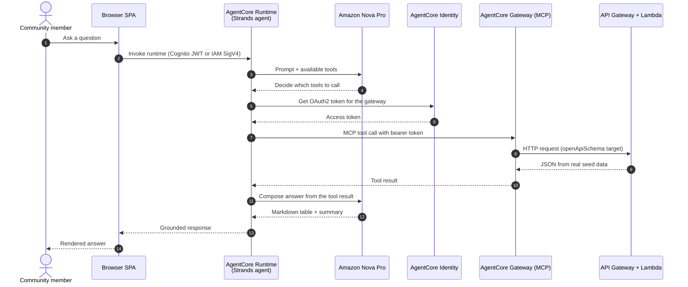
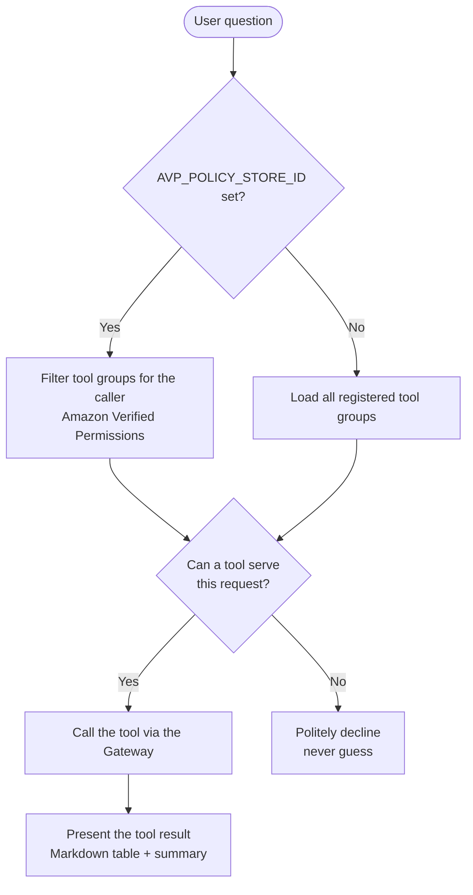
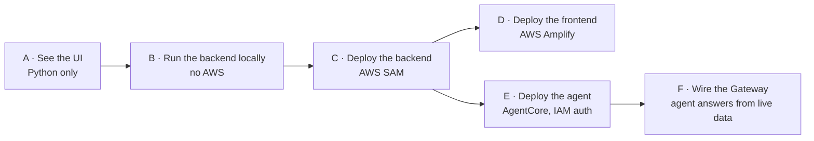
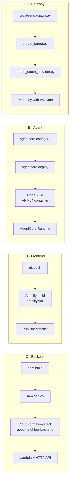
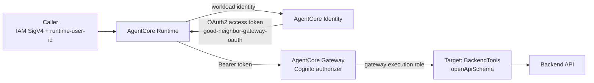
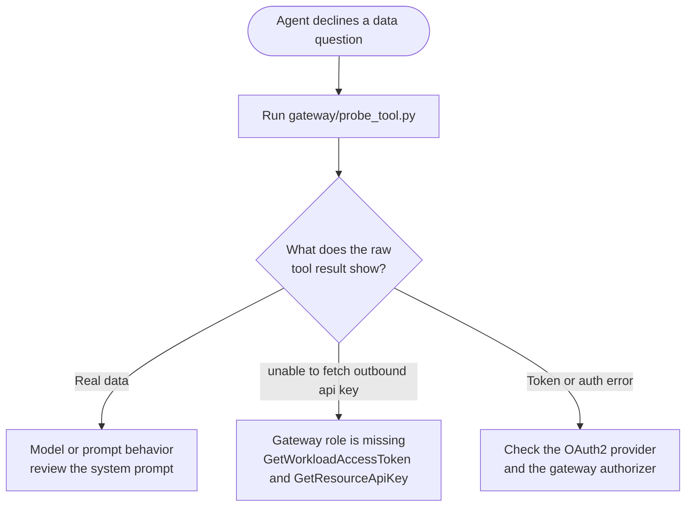
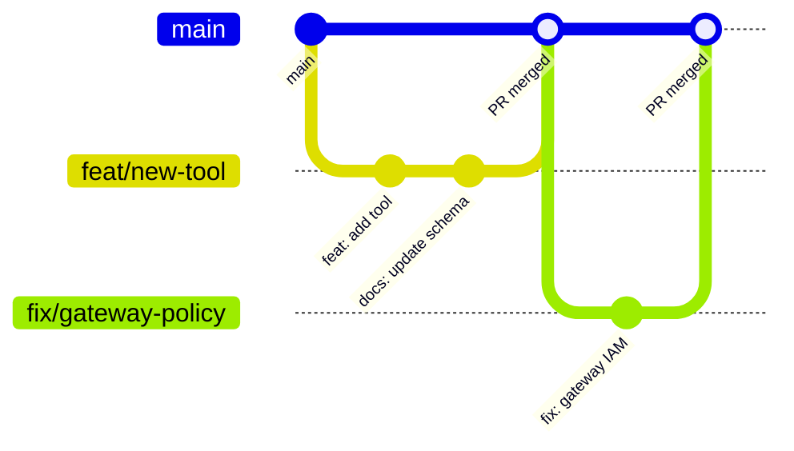

<div align="center">
 🏆 Agents for Humans Hackathon Submission

Track: Good Neighbor Agents An agent that helps groups of people, not just one: neighborhoods, nonprofits, food banks, schools, libraries, and small local orgs.

# 🤖 Good Neighbor Agent

### Community Waste Recovery — turn surplus into support.

**A grounded AI agent that helps a whole community recover and redistribute surplus food instead of throwing it away.**

[](https://main.dfwth112aeze8.amplifyapp.com/)
[](LICENSE)
[](#deployed-resources)


[Live App](https://main.dfwth112aeze8.amplifyapp.com/) ·
[Architecture](#architecture) ·
[What It Can Do](#what-it-can-do) ·
[Getting Started](#getting-started) ·
[Live Agent Demo](#live-agent-demo) ·
[Contributors](#contributors)

</div>

---

## Table of Contents

- [Overview](#overview)
- [Highlights](#highlights)
- [Links](#links)
- [Architecture](#architecture)
- [What It Can Do](#what-it-can-do)
- [Tech Stack](#tech-stack)
- [Repository Layout](#repository-layout)
- [Getting Started](#getting-started)
- [Deployed Resources](#deployed-resources)
- [How the Agent Works](#how-the-agent-works)
- [Live Agent Demo](#live-agent-demo)
- [Configuration Reference](#configuration-reference)
- [Observability](#observability)
- [Troubleshooting](#troubleshooting)
- [Teardown](#teardown)
- [Contributors](#contributors)
- [Contributing](#contributing)
- [License](#license)

---

## Overview

Every day, good food and useful goods go to waste while food banks, shelters, and
neighbors go without. The problem is rarely a lack of supply. It's a **matching and
logistics** problem: who has surplus, who needs it, and who can move it before it
spoils.

**Good Neighbor Agent** closes that gap. It connects people who **have** surplus
(grocers, restaurants, schools) with people who can **use** it (food banks, shelters,
neighbors), and routes **volunteers and vehicles** to move it.

The agent is a [Strands](https://strandsagents.com/) agent running on the
**Amazon Bedrock AgentCore Runtime** with **Amazon Nova Pro**. It reaches its backend
tools through an **AgentCore Gateway** (MCP), and those tools serve real community data
from **AWS Lambda + API Gateway**. A browser SPA lets people sign in and chat with it.



> [!NOTE]
> **Status:** deployed and verified end to end in AWS (`us-east-1`). Ask the live agent
> *"What are the current pantry stock levels?"* and it returns a table built from real
> backend data.

---

## Highlights

| | Feature | Why it matters |
|---|---|---|
| 🎯 | **Grounded answers** | The agent answers **only** from live tool data. It never guesses, and it declines when no tool can serve a request. |
| 🔌 | **Real tools over MCP** | Backend tools are exposed through an AgentCore Gateway and backed by AWS Lambda + API Gateway. |
| 🧠 | **Amazon Nova Pro** | Amazon's own model family, so there is no Marketplace subscription or payment-instrument gate. |
| 🔐 | **Secure by design** | Cognito email one-time-code sign-in, IAM (SigV4) inbound auth, OAuth2 outbound auth via AgentCore Identity, and optional per-request tool filtering with Amazon Verified Permissions. |
| 🧪 | **Runs anywhere** | Explore the UI with no AWS, run the real backend locally with no AWS, then deploy step by step. |
| 🔍 | **Observable** | Every layer logs to Amazon CloudWatch, plus a probe script to inspect raw gateway results. |

---

## Links

| Resource | Link |
|----------|------|
| **Live app** | <https://main.dfwth112aeze8.amplifyapp.com/> |
| **Source code** | <https://github.com/MariyamSeemab/Community-Waste-Agent-> |
| **Project writeup** | [`docs/ABOUT.md`](docs/ABOUT.md) — inspiration, build, challenges, testing |
| **Architecture (AWS icons)** | [`docs/architecture-aws-icons.drawio`](docs/architecture-aws-icons.drawio) |
| **Architecture (plain boxes)** | [`docs/architecture.drawio`](docs/architecture.drawio) |

> [!TIP]
> The live app runs the frontend on AWS Amplify. Sign in with an email and the one-time
> code to try it. In **demo mode**, use code `123456`.

---

## Architecture


*Editable sources: [`docs/architecture-aws-icons.drawio`](docs/architecture-aws-icons.drawio) uses the official AWS service icons (Amplify, Cognito, Bedrock/AgentCore, API Gateway, Lambda, Secrets Manager, IAM, CodeBuild, ECR, CloudWatch). [`docs/architecture.drawio`](docs/architecture.drawio) is a simpler plain-box version of the same flow.*

### System overview



### Two ways the frontend reaches data

Both paths are built:



- **Direct** — the SPA calls the backend API directly (`BACKEND_API_URL`). Great for
  demos; no agent or LLM is involved.
- **Through the agent** — the SPA calls the AgentCore Runtime. The Nova agent decides
  which tools to call via the Gateway and answers in natural language.

### Request lifecycle

What happens when someone asks *"Which food bank needs the available produce?"*



---

## What It Can Do

The agent answers **only** from live tool data. Its tools:

| Capability | What it provides |
|------------|------------------|
| **Donation & food-safety guidelines** | Acceptance rules and safe donation windows |
| **Surplus donation listings** | Surplus food and goods posted by donors |
| **Community resource catalog** | Categories of items circulating in the network |
| **Recipient needs** | What food banks, shelters, and partners are requesting |
| **Pantry / stock levels** | Current stock at partner pantries, with a low-stock flag |
| **Volunteers & vehicles** | Available drivers and vehicles for pickups and deliveries |

Together these are backed by **seven tools** exposed through the Gateway.

**Example question:**

> *"A grocer has 40 lbs of produce that must be picked up by Friday — which food bank
> needs it, and who could drive it there?"*

### Grounded by design



---

## Tech Stack

| Layer | Technology |
|-------|------------|
| **Agent framework** | Strands Agents (Python) |
| **Agent hosting** | Amazon Bedrock AgentCore Runtime |
| **Model** | Amazon Nova Pro (`us.amazon.nova-pro-v1:0`) via Strands `BedrockModel` |
| **Tool access** | AgentCore Gateway (MCP) with an `openApiSchema` target |
| **Identity & auth** | Amazon Cognito (email one-time code), AgentCore Identity (outbound OAuth2), IAM SigV4, optional Amazon Verified Permissions |
| **Backend** | Stdlib-only Python handlers on AWS Lambda + HTTP API Gateway, deployed with AWS SAM |
| **Frontend** | Static SPA (`static/`) on AWS Amplify (or S3 + CloudFront) |
| **Container build** | AWS CodeBuild builds the ARM64 image remotely, so no local Docker |
| **Observability** | Amazon CloudWatch |

---

## Repository Layout

```text
.
├── README.md                     # This file
├── amplify.yml                   # AWS Amplify Hosting build spec (publishes static/)
├── docs/
│   ├── ABOUT.md                  # Project writeup
│   ├── architecture-aws-icons.drawio   # Diagram with official AWS icons
│   └── architecture.drawio       # Editable plain-box architecture diagram
├── schemas/                      # OpenAPI + Lambda schemas (tool contracts)
├── backend/                      # Tool implementations + real seed data
│   ├── README.md                 # Backend structure, data model, run + deploy
│   ├── server.py                 # Local dev server (no AWS) exposing every tool
│   ├── lambda_function.py        # AWS Lambda entrypoint (routes by path)
│   ├── template.yaml             # AWS SAM template (Lambda + HTTP API Gateway)
│   ├── samconfig.toml            # SAM deploy defaults (stack name, region)
│   ├── common.py                 # Shared data loading + response helpers
│   ├── data/                     # Seed JSON: resources, surplus, needs, pantry,
│   │                             #   volunteers, vehicles, guidelines
│   └── handlers/                 # guidelines · community · pantry · logistics
└── static/                       # Frontend SPA (deploy via Amplify or S3 + CloudFront)
    ├── index.html                # Login + chat UI + "How it works" panel
    ├── app.js                    # Cognito sign-in + AgentCore/backend calls + rendering
    ├── styles.css                # Animated chat UI
    ├── config.js                 # Runtime config (Cognito, AgentCore, BACKEND_API_URL)
    ├── README.md                 # Frontend + Amplify deploy docs
    └── AgentCode/                # The deployable agent (NOT published to the web)
        ├── agent.py              # Strands agent + AgentCore Runtime entrypoint (Amazon Nova)
        ├── requirements.txt      # Python dependencies (strands-agents pinned)
        ├── deploy-agent-noauth.ps1       # Deploy the agent with IAM auth (no Cognito)
        ├── iam/                          # Standalone execution role trust + permissions
        ├── gateway/                      # Scripts to wire the Gateway to the backend
        │   ├── backend-openapi.json      # Combined OpenAPI spec for the 7 tools
        │   ├── create_target.py          # Create the openApiSchema gateway target
        │   ├── create_oauth_provider.py  # Create the outbound OAuth2 provider
        │   ├── gateway-workload-policy.json  # IAM the gateway role needs
        │   └── probe_tool.py             # Call the gateway's MCP endpoint directly (debug)
        ├── launchAgent.sh                # Cognito/bootstrap-stack flow (alternative)
        └── deploy-agentcore-runtime.sh   # Cognito configure + launch (used by launchAgent.sh)
```

---

## Getting Started

### Clone the repository

```bash
git clone https://github.com/MariyamSeemab/Community-Waste-Agent-.git
cd Community-Waste-Agent-
```

### Pick your goal

Goals **A → F** increase in scope, and each stands on its own.



| Goal | What you get | You need |
|------|--------------|----------|
| **A** | Explore the animated UI in demo mode | Python |
| **B** | The real backend running locally | Python (stdlib only, nothing to install) |
| **C** | Live backend on Lambda + HTTP API Gateway | AWS CLI, AWS SAM CLI, configured credentials |
| **D** | Hosted frontend | Git repo + AWS Amplify console |
| **E** | The Nova agent on AgentCore Runtime | `bedrock-agentcore-starter-toolkit`, Bedrock access to Amazon Nova, an execution role |
| **F** | Agent grounded in real backend data via the Gateway | Everything above |

### A. Just see the UI (no AWS)

Only needs Python.

```bash
cd static
python -m http.server 8000
# open http://localhost:8000 - sign in with any email + code 123456
```

Runs in **demo mode** (mocked replies) so you can explore the animated UI and the
"How it works" panel. Motion respects `prefers-reduced-motion`.

### B. Run the real backend locally (no AWS)

The backend is stdlib-only Python, so there is nothing to install.

```bash
# terminal 1 - start the tools API
python backend/server.py                       # http://localhost:8080
curl "http://localhost:8080/pantry"            # real seed data

# then point the SPA at it: in static/config.js set
#   BACKEND_API_URL: 'http://localhost:8080',
# and serve the frontend as in step A.
```

The SPA badge switches to **Live backend data**, and answers come from the real
handlers and seed data. See [`backend/README.md`](backend/README.md) for the data model
and every endpoint.

### C. Deploy the backend to AWS

Needs the **AWS CLI** and **AWS SAM CLI** with credentials configured.

```bash
cd backend
sam build
sam deploy            # creates CloudFormation stack: good-neighbor-backend (us-east-1)
```

Copy the `ApiBaseUrl` output into `static/config.js` as `BACKEND_API_URL`. The frontend
now talks to your live AWS backend (Lambda + HTTP API Gateway).

### D. Deploy the frontend to AWS Amplify

Push this repo to Git, then in the **Amplify console**:
*New app → Host web app → connect the repo → deploy*.

Amplify auto-detects [`amplify.yml`](amplify.yml), which publishes `static/` and prunes
the backend `AgentCode/` from the web root. To inject `config.js` from Amplify
environment variables instead of committing it, see the commented block in
`amplify.yml`.

### E. Deploy the agent to AgentCore (no Cognito)

This runs the Strands agent on **AgentCore Runtime** with **Amazon Nova Pro**, using
**AWS IAM (SigV4)** inbound auth. There is no Cognito and no `bootstrap-stack`.

**Prerequisites**

- `pip install bedrock-agentcore-starter-toolkit` (gives the `agentcore` CLI)
- **Bedrock model access** for Amazon Nova in your region (Nova needs no Marketplace
  subscription, so there is no payment-instrument gate)
- A standalone execution role. The trust and permissions JSON is in
  [`static/AgentCode/iam/`](static/AgentCode/iam)

```powershell
cd static/AgentCode
# Windows: force UTF-8 so the CLI's console output doesn't crash on cp1252
$env:PYTHONUTF8=1; $env:PYTHONIOENCODING="utf-8"
powershell -ExecutionPolicy Bypass -File .\deploy-agent-noauth.ps1
```

The script runs `agentcore configure` (no `--authorizer-config`, which means IAM auth),
then `agentcore deploy`, which builds the ARM64 container remotely via CodeBuild with no
local Docker. Invoke it, passing a `--runtime-user-id` (see below for why):

```powershell
'{"prompt": "hello"}' | Out-File -Encoding ascii payload.json
aws bedrock-agentcore invoke-agent-runtime --region us-east-1 `
  --agent-runtime-arn <RUNTIME_ARN> --runtime-user-id demo-user `
  --payload fileb://payload.json --content-type application/json --accept application/json out.json
```

> [!NOTE]
> There is also a Cognito-based path (`launchAgent.sh` + `deploy-agentcore-runtime.sh`)
> that uses a `bootstrap-stack` for the Cognito pool, S3, and CloudFront. Use the
> no-Cognito path above unless you already have that stack.

### F. Wire the agent to the live backend (Gateway)

This is what makes the agent answer from **real** data instead of only its own
reasoning. The backend REST API is fronted by an **AgentCore Gateway**, exposed to the
agent over MCP.

```bash
# 1. Create the gateway (auto-creates a Cognito authorizer + gateway role)
agentcore gateway create-mcp-gateway --region us-east-1 --name GoodNeighborGateway

# 2. Register the backend as an MCP tool target (edit IDs in the script first)
python static/AgentCode/gateway/create_target.py

# 3. Create the outbound OAuth2 provider the agent uses to call the gateway
python static/AgentCode/gateway/create_oauth_provider.py

# 4. Point the runtime at the gateway and redeploy
cd static/AgentCode
agentcore deploy --auto-update-on-conflict `
  --env COMMUNITY_GATEWAY_URL=<gateway mcp url> `
  --env COMMUNITY_OAUTH_PROVIDER=good-neighbor-gateway-oauth
```

Then invoke with a data question (again, pass `--runtime-user-id`):

```powershell
'{"prompt": "What are the current pantry stock levels?"}' | Out-File -Encoding ascii q.json
aws bedrock-agentcore invoke-agent-runtime --region us-east-1 `
  --agent-runtime-arn <RUNTIME_ARN> --runtime-user-id demo-user `
  --payload fileb://q.json --content-type application/json --accept application/json out.json
```

The agent returns a Markdown table of the live pantry data plus a summary.

**Why `--runtime-user-id`?** The runtime uses IAM (SigV4) inbound auth, so the outbound
machine-to-machine token flow (AgentCore Identity) needs a workload identity, and the
user id supplies it. Without it you get *"Workload access token has not been set."*

**Debugging:** [`gateway/probe_tool.py`](static/AgentCode/gateway/probe_tool.py) calls
the gateway's MCP endpoint directly (token → list tools → call one), so you can see the
exact tool result the agent receives. This is the fastest way to tell an auth failure
apart from a model-behavior issue.

### Deployment pipeline



---

## Deployed Resources

A reference deployment in `us-east-1`. Replace these with the identifiers from your own
deploy.

| Resource | Identifier |
|----------|------------|
| Backend stack | `good-neighbor-backend` (Lambda + HTTP API) |
| Backend API URL | `https://h1aly0x3a1.execute-api.us-east-1.amazonaws.com` |
| Agent runtime | `good_neighbor_agent-m0NZWbGrv5` (Amazon Nova Pro, IAM auth) |
| Runtime exec role | `good-neighbor-agent-exec-role` |
| Gateway | `goodneighborgateway-y0bvoowruo` |
| Gateway target | `BackendTools` (openApiSchema → backend API) |
| Gateway exec role | `AgentCoreGatewayExecutionRole` |
| Outbound OAuth2 provider | `good-neighbor-gateway-oauth` |

---

## How the Agent Works

`agent.py` defines a Strands `Agent` fronted by the AgentCore Runtime
(`BedrockAgentCoreApp`).

- **Model** — Amazon Nova Pro (`us.amazon.nova-pro-v1:0`) via the Strands
  `BedrockModel`. It is Amazon's own model family, so no Marketplace subscription is
  needed. That avoids the `INVALID_PAYMENT_INSTRUMENT` gate that third-party models can
  hit.
- **Tool groups** — the agent registers a tool group only when its gateway URL is
  configured, so it runs with any subset of tools. Nothing connects at import time, and
  connections open per request. In the current deploy the **community** group is wired
  to the Gateway, and that one Gateway exposes all backend tools.
- **Grounded** — the system prompt leads with "use the tool result." When a tool returns
  data the agent must present it (Markdown table + summary), and it declines only when no
  tool can serve the request.
- **Optional AVP** — if `AVP_POLICY_STORE_ID` is set, tools are filtered per request
  against the caller's identity via Amazon Verified Permissions. Unset, all registered
  groups load.

### Auth chain



---

## Live Agent Demo

With the deployed AWS environment, invoke the AgentCore runtime using
`--runtime-user-id demo-user`, then try these questions.

**"Show current surplus donations."**


**"Which volunteers are available?"**


**"What are the current pantry stock levels?"**


**"Which food bank needs the available produce?"**


### Grounding test

Ask an unrelated question such as **"What's the weather tomorrow?"** The agent should
**decline**, because it only answers from verified tool data.


---

## Configuration Reference

### Agent runtime

Set environment variables via `agentcore deploy --env KEY=VALUE`:

| Variable | Purpose |
|----------|---------|
| `AWS_REGION` | AWS region (default `us-east-1`) |
| `COMMUNITY_GATEWAY_URL` | MCP URL of the gateway the agent calls |
| `COMMUNITY_OAUTH_PROVIDER` | AgentCore Identity provider name for the gateway |
| `GUIDELINES_GATEWAY_URL` | *(optional)* separate guidelines gateway (SigV4) |
| `PANTRY_GATEWAY_URL` / `PANTRY_OAUTH_PROVIDER` | *(optional)* separate pantry gateway |
| `LOGISTICS_GATEWAY_URL` / `LOGISTICS_OAUTH_PROVIDER` | *(optional)* separate logistics gateway |
| `AVP_POLICY_STORE_ID` | *(optional)* enables per-request AVP tool filtering |

### Frontend

`static/config.js` (`window.WORKSHOP_CONFIG`):

| Key | Purpose |
|-----|---------|
| `BACKEND_API_URL` | Deployed backend API. The SPA answers directly from it |
| `COGNITO_USER_POOL_ID` / `COGNITO_CLIENT_ID` / `COGNITO_REGION` | Cognito email one-time-code sign-in |
| `AGENTCORE_RUNTIME_ARN` / `AGENTCORE_ENDPOINT` | Call the agent runtime from the browser |

### IAM permissions

The wiring requires the following. Each missing permission otherwise surfaces as an
`AccessDeniedException`.

| Role | Required permissions |
|------|----------------------|
| **Runtime role** (`good-neighbor-agent-exec-role`) | Bedrock invoke, `bedrock-agentcore:GetResourceOauth2Token`, `GetWorkloadAccessToken*`, and `secretsmanager:GetSecretValue` on `bedrock-agentcore-identity!default/*` |
| **Gateway role** (`AgentCoreGatewayExecutionRole`) | `bedrock-agentcore:GetWorkloadAccessToken` + `GetResourceApiKey` — see [`gateway-workload-policy.json`](static/AgentCode/gateway/gateway-workload-policy.json) |

---

## Observability

Every layer logs to **Amazon CloudWatch**.

| Component | CloudWatch log group |
|-----------|----------------------|
| AgentCore Runtime | `/aws/bedrock-agentcore/runtimes/good_neighbor_agent-<id>-DEFAULT` |
| AgentCore Gateway | `/aws/vendedlogs/bedrock-agentcore/gateway/APPLICATION_LOGS/goodneighborgateway-<id>` |
| Backend Lambda | `/aws/lambda/good-neighbor-backend` |
| Container build | CodeBuild build logs (per `agentcore deploy`) |

Tail the agent live while invoking it:

```bash
aws logs tail /aws/bedrock-agentcore/runtimes/good_neighbor_agent-<id>-DEFAULT \
  --region us-east-1 --follow
```

The runtime log shows tool registration, each tool call, the model response, and full
tracebacks. This is where the auth-chain `AccessDenied` errors surfaced. The gateway log
is where a tool call can show HTTP 200 while the body is an *"unable to fetch outbound
api key"* error (a missing gateway permission).

Tracing is off by default: the runtime is deployed with `--disable-otel`, and the
gateway's X-Ray trace delivery is left disabled, because logs are enough to operate it.
Enabling OpenTelemetry / X-Ray is a one-flag change for deeper request tracing.

> [!TIP]
> To inspect a tool result without the model, run
> [`gateway/probe_tool.py`](static/AgentCode/gateway/probe_tool.py). Logs tell you
> *where* a request broke, and the probe tells you *what* the gateway returned.

---

## Troubleshooting



| Symptom | Cause and fix |
|---------|---------------|
| **Agent replies "I'm not able to help…" for data questions** | The tool returned an error, or the prompt is over-declining. Run `gateway/probe_tool.py` to see the raw tool result. If it shows *"unable to fetch outbound api key"*, the gateway role is missing `GetWorkloadAccessToken` / `GetResourceApiKey`. |
| **"Workload access token has not been set"** | Invoke with `--runtime-user-id`. |
| **`INVALID_PAYMENT_INSTRUMENT`** | You're on a third-party model. Switch to Amazon Nova, or add a payment method and enable the model in Bedrock. |
| **`agentcore` CLI crashes with a `UnicodeEncodeError` on Windows** | Set `$env:PYTHONUTF8=1; $env:PYTHONIOENCODING="utf-8"` first. |
| **`agentcore deploy` seems to hang or stops mid-build** | Let it run to completion, since it monitors CodeBuild. Use `--auto-update-on-conflict` to update an existing runtime. |
| **SAM CLI shows a non-zero exit on Windows** | Its progress banner goes to stderr. Trust the textual `Successfully created/updated stack` result. |

---

## Teardown

Remove everything a full deploy created (stops any charges):

```bash
# Backend (Lambda + API Gateway)
sam delete --stack-name good-neighbor-backend --region us-east-1

# Agent runtime
agentcore destroy

# Gateway + target, OAuth2 provider, and the IAM roles/Cognito pool the gateway
# auto-created are removed via the console or the bedrock-agentcore-control API.
```

---

## Contributors

Good Neighbor Agent is built by:

<table>
  <tr>
    <td align="center" width="200">
      <a href="https://github.com/MariyamSeemab">
        <br />
        <sub><b>MariyamSeemab</b></sub>
      </a>
    </td>
    <td align="center" width="200">
      <a href="https://github.com/dineshrajdhanapathyDD">
        <br />
        <sub><b>dineshrajdhanapathyDD</b></sub>
      </a>
    </td>
  </tr>
</table>

---

## Contributing

Contributions, issues, and ideas are welcome.



1. **Fork** the repository, then clone your fork and create a branch from `main`:
   ```bash
   git clone https://github.com/<your-username>/Community-Waste-Agent-.git
   cd Community-Waste-Agent-
   git checkout -b feat/your-feature
   ```
2. **Make your changes.** The backend runs locally with no AWS (goal B above), so verify
   affected endpoints with `curl` before opening a PR.
3. **Commit** using [Conventional Commits](https://www.conventionalcommits.org):

   | Prefix | Use for |
   |--------|---------|
   | `feat:` | A new feature |
   | `fix:` | A bug fix |
   | `docs:` | Documentation only |
   | `refactor:` | Code change with no behavior change |
   | `chore:` | Tooling, config, dependencies |

4. **Push** your branch and open a **Pull Request** describing *what* changed and *why*.

**Branch naming:** `feat/…` · `fix/…` · `docs/…` · `refactor/…` · `chore/…`

### Adding a new tool

As a guide, a new tool touches these places:

1. Add seed data in `backend/data/` and a handler in `backend/handlers/`.
2. Route it in `backend/lambda_function.py` and expose it in `backend/server.py`.
3. Update the OpenAPI contracts in `schemas/` and
   `static/AgentCode/gateway/backend-openapi.json`.
4. Update the gateway target so the agent can discover the new tool.

> [!IMPORTANT]
> Never commit real credentials. `static/config.js` holds runtime configuration, so use
> Amplify environment variables (see the commented block in `amplify.yml`) for anything
> environment-specific. Demo code `123456` works in demo mode only.

---

## License

Distributed under the **MIT License**. See [`LICENSE`](LICENSE).

Copyright © 2026 [Mariyam Seemab](https://github.com/MariyamSeemab) and [DineshRaj Dhanapathy](https://github.com/dineshrajdhanapathyDD).

---

<div align="center">

**🤖 Good Neighbor Agent** · *Surplus shouldn't go to waste. Neighbors shouldn't go without.*

[⬆ Back to top](#-good-neighbor-agent)

</div>
